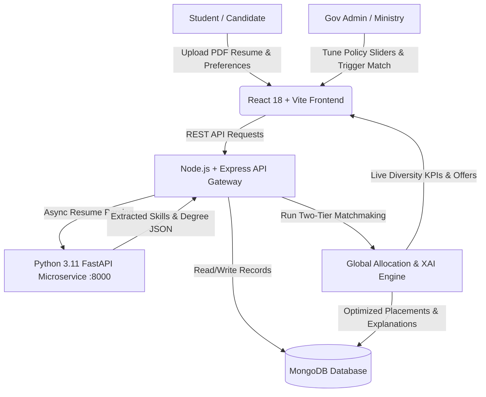

<div align="center">

# 🇮🇳 InternSetu (Smart Allocation Engine)
### **AI-Powered Multidimensional Matchmaking & Affirmative Action Optimizer for PM Internship Scheme**

[](https://sih.gov.in)
[](https://react.dev/)
[](https://nodejs.org/)
[](https://fastapi.tiangolo.com/)
[](https://www.mongodb.com/)
[](LICENSE)

*An intelligent, decentralized, and transparent platform that automates national internship allocations in seconds while strictly balancing candidate merit, student preference rankings, and constitutional affirmative action goals.*

---

[🚀 Quick Start](#-quick-start-guide) • [✨ Key Features](#-key-features) • [🏗️ System Architecture](#-system-architecture) • [📊 Matching Methodology](#-matching--scoring-methodology) • [🔑 Demo Logins](#-demo-login-credentials)

</div>

---

## 📌 Problem Statement Overview (SIH25033)

The **Prime Minister’s Internship Scheme (PMIS)** aims to provide 1 crore Indian youth with 12 months of high-value industry exposure across top corporate enterprises. However, traditional manual matching systems suffer from critical bottlenecks:
* **Manual Delay**: Processing millions of diverse applications takes 2–4 months.
* **Complex Affirmative Action Quotas**: Difficult to balance regional inclusivity (112+ Aspirational Districts, Rural Youth, Women in STEM, SC/ST/OBC/EWS) without compromising technical skill requirements.
* **Black-Box Allocations**: Lack of clear explanations creates distrust among applicants.
* **Seat Wastage**: When candidates decline offers, vacant seats often go unfilled.

**InternSetu** solves this end-to-end with an automated, explainable, and multi-capacity AI allocation engine.

---

## ✨ Key Features

| Feature | Description |
| :--- | :--- |
| 📄 **AI Resume Parser (FastAPI + PyPDF)** | Automated extraction of technical skills, academic degrees, branches, and years of experience from uploaded PDF resumes in sub-seconds. |
| 🎯 **Two-Tier Matchmaking Algorithm** | Balances candidate qualification merit (skills, top 3 preference rankings, location) with constitutional affirmative action quotas. |
| 🎛️ **Policy Weight Simulator** | Interactive slider tool allowing government officials to tune policy weights with live "What-If" demographic KPI preview before 1-click execution. |
| 💡 **Explainable AI (XAI) Transparency** | Generates plain-language justification breakdowns for every placement decision (e.g. *Skills 36/40 + Choice #1 Bonus + Aspirational District Boost*). |
| 🔄 **Dynamic Waitlist Auto-Promotion** | If a candidate declines an offer, the vacant seat is immediately re-allocated to the next highest-fit waitlisted candidate. |
| 🌓 **Dual Modern Web Portals** | Responsive, WCAG-compliant portals for **Candidates** and **Government Admins** with seamless Dark/Light theme switching. |

---

## 🏗️ System Architecture

InternSetu follows a decoupled, high-throughput microservice architecture:



### 🛠️ Technology Stack
* **Frontend**: React 18, Vite, React Router, Custom CSS Design Tokens (Theme-aware).
* **Backend Gateway**: Node.js, Express.js, JWT Authentication, Bcrypt encryption, CORS.
* **AI & Document Parser**: Python 3.11, FastAPI, Uvicorn, PyPDF, Regular Expression Entity Matcher.
* **Database**: MongoDB (Mongoose ORM) with flexible schema for affirmative action attributes.

---

## 📊 Matching & Scoring Methodology

Our matching engine computes a composite multi-factor score for every candidate-internship pair:

$$\\text{Total Match Score} = \\underbrace{(0.40 \\cdot \\text{Skill} + 0.25 \\cdot \\text{Choice} + 0.20 \\cdot \\text{Location} + 0.15 \\cdot \\text{Edu})}_{\\text{Tier 1: Merit \\& Preference Fit (80\\%)}} + \\underbrace{\\text{Affirmative Action Bonus}}_{\\text{Tier 2: Inclusivity Uplift (20\\%)}}$$

### Tier 1: Merit & Preference Fit (Base Score)
1. **Technical Skill Overlap (40%)**: Vector similarity and token containment over required skill sets.
2. **Candidate Choice Ranking (25%)**: Priority multiplier awarded to candidate's #1 Ranked choice, followed by #2 and #3.
3. **Geo-Location & Sector Alignment (20%)**: Distance and preferred industry alignment.
4. **Qualifications & Experience (15%)**: Degree eligibility and normalization.

### Tier 2: Affirmative Action & Inclusivity Boost
* 📍 **Aspirational Districts Boost**: `+15 pts` (NITI Aayog baseline).
* 🌾 **Rural Youth Empowerment**: `+10 pts` (Rural domicile).
* 👩‍💻 **Women in STEM**: `+10 pts` (Gender diversity equity).
* 🛡️ **Social Categories**: SC, ST, OBC, EWS proportional allocation.
* ⏳ **First-Time Beneficiary Priority**: Fair chance policy prioritizing first-time applicants over repeat beneficiaries.

---

## 🚀 Quick Start Guide

### 📋 Prerequisites
Make sure you have the following installed on your machine:
* [Node.js](https://nodejs.org/) (v18 or newer)
* [Python](https://www.python.org/) (v3.10 or newer)
* [MongoDB Community Server](https://www.mongodb.com/try/download/community) *(or MongoDB Atlas connection URI)*
* [Git](https://git-scm.com/)

---

### 📥 1. Clone the Repository
```bash
git clone https://github.com/ManuStu-web/InternshipMatching.git
cd InternshipMatching
```

---

### ⚙️ 2. Run the 3 Microservices (Open 3 Terminals)

#### 🖥️ Terminal 1: Python AI Resume Parser (Port 8000)
```bash
cd AI
pip install -r requirements.txt
uvicorn main:app --reload --port 8000
```
> *Runs on `http://localhost:8000` (Swagger docs available at `http://localhost:8000/docs`)*

---

#### 🖥️ Terminal 2: Node.js Backend Server (Port 5000)
```bash
cd Backend
npm install
```

Create a **`.env`** file inside `Backend/`:
```env
PORT=5000
MONGO_URI=mongodb://127.0.0.1:27017/sih25033
JWT_SECRET=sih_pmis_smart_allocation_secret_2026
PARSER_BASE_URL=http://localhost:8000
```

Seed the database with diverse demo candidates & nationwide internships:
```bash
node seed.js
node server.js
```
> *Runs on `http://localhost:5000`*

---

#### 🖥️ Terminal 3: React Frontend (Port 5173)
```bash
cd Frontend
npm install
```

Create a **`.env`** file inside `Frontend/`:
```env
VITE_API_BASE_URL=http://localhost:5000/api
```

Start the Vite development server:
```bash
npm run dev
```
> *Open your browser and navigate to **`http://localhost:5173`***

---

## 🔑 Demo Login Credentials

### 🏛️ 1. Government / Ministry Portal
* **Email**: `admin@india.gov.in`
* **Password**: `admin123`
* **Features**: Live Affirmative Action KPIs, Interactive Policy Weight Simulator Sliders, Nationwide 1-Click Allocation, Unallocate/Reset tools, Candidate Master Directory.

### 🎓 2. Candidate / Student Portal
* **Email**: `priya@example.com` *(or `ramesh@example.com`, `manoj@example.com`)*
* **Password**: `password123`
* **Features**: AI Resume Upload & Skill Extraction, Top 3 Choice Ranking (#1, #2, #3), Transparent Match Breakdown, Offer Accept / Decline with XAI Justification.

---

## 📁 Project Directory Structure

```text
InternshipMatching/
├── AI/                          # Python FastAPI Resume Parser Microservice
│   ├── main.py                  # FastAPI server endpoints (/parse-resume)
│   ├── parser/
│   │   └── resume_parser.py     # PyPDF text & entity extraction logic
│   └── requirements.txt         # FastAPI, Uvicorn, PyPDF dependencies
│
├── Backend/                     # Node.js & Express API Gateway
│   ├── config/                  # Database connection (MongoDB)
│   ├── controllers/             # Auth, Candidate, Government, Allocation controllers
│   ├── middleware/              # JWT auth and role-based verification
│   ├── models/                  # Candidate, Internship, Allocation Mongoose schemas
│   ├── routes/                  # REST API route handlers
│   ├── seed.js                  # Database seed script for SIH demonstration
│   ├── server.js                # Server entry point
│   └── package.json
│
├── Frontend/                    # React 18 + Vite SPA
│   ├── src/
│   │   ├── components/          # Theme toggle, Sidebar, Layout wrappers
│   │   ├── context/             # AuthContext & State management
│   │   ├── pages/
│   │   │   ├── candidate/       # Dashboard, Resume, Internships, Application status
│   │   │   ├── government/      # Dashboard, Policy Simulator, Allocation engine
│   │   │   └── AuthPage.jsx     # Dual-role animated login page
│   │   ├── index.css            # Custom theme tokens, responsive styles & animations
│   │   └── App.jsx
│   └── package.json
│
└── README.md                    # Project documentation
```

---

## 🛡️ Security & DPDP Act 2023 Compliance
* **Data Sovereignty**: Open-source, zero proprietary cloud dependency — fully deployable on **NIC / MeitY Government Cloud**.
* **Role-Based Access Control (RBAC)**: Strict segregation between student private profiles and administrator governance tools.
* **Encrypted Authentication**: Bcrypt password hashing with signed JWT session tokens.
* **Auditable XAI Logs**: Every allocation decision records transparent scoring weights for judicial, statutory, and RTI scrutiny.

---

## 👥 Team Code Sign (SIH25033)

Developed for **Smart India Hackathon (SIH)** under the **Ministry of Corporate Affairs (MoCA)** initiative for the **Prime Minister's Internship Scheme**.

* **Repository**: [https://github.com/ManuStu-web/InternshipMatching](https://github.com/ManuStu-web/InternshipMatching)
* **License**: MIT License
